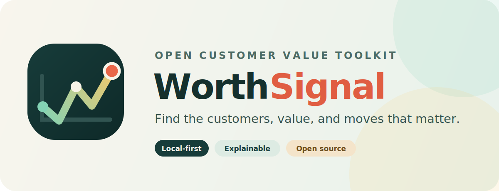

<p align="center">
  
</p>

<p align="center">
  <a href="https://github.com/UlrikErlingsen/customer-value-analytics/actions/workflows/tests.yml"></a>
  
  
  <a href="LICENSE"></a>
</p>

<p align="center"><strong>Open customer-value analytics for marketers — transparent models, local-first data, no black box.</strong></p>

**WorthSignal** turns an Excel, CSV, or JSON customer file into segmentation, lifetime value, retention, and marketing ROI through a point-and-click interface. Confirm the suggested columns, run an analysis, and download the results as Excel or JSON. No account is required, the methods are documented, and local mode keeps customer data on your computer.

## Read this first

> **Use estimates wisely.** Every model simplifies real customer behaviour and depends on the quality of its inputs. Treat each output as **decision support, not truth**: use it to compare options, challenge assumptions, and frame discussions — not as a precise prediction of the future.

## Why WorthSignal

- **Made for working marketers:** guided pages, plain-language errors, downloadable templates, and no notebook or statistics software required.
- **Explainable by design:** every method is named, documented, cited, and tested against published or independently derived references.
- **Local-first:** run it on your computer with no account, telemetry, or built-in customer-data storage.
- **Portable:** read Excel, CSV, and JSON; export every result to Excel or JSON.

## Get the app

You need the project folder on your computer first. Two ways — pick one:

- **No tools needed (easiest):** on the project's GitHub page, click the green **Code** button → **Download ZIP**. Unzip it anywhere (for example your Desktop) and open the unzipped folder.
- **With git:**

  ```bash
  git clone https://github.com/UlrikErlingsen/customer-value-analytics.git
  ```

You also need **Python 3.10 or newer** — many computers already have it. If not, install it free from [python.org/downloads](https://www.python.org/downloads/). **On Windows, tick the "Add python.exe to PATH" checkbox during installation** — it matters.

## Quick start

**Windows**

1. In the project folder, double-click `run_app.bat`.
2. The first start creates a local `.venv` folder and installs everything the app needs (a few minutes). Later starts skip this.
3. A browser tab opens with the app.

If Windows shows a protection warning for a downloaded file, click **More info → Run anyway**.

**Mac**

1. In the project folder, double-click `run_app.command`.
2. The first start installs everything into a local `.venv` folder. Later starts skip this.
3. A browser tab opens with the app.

If macOS blocks the first double-click, right-click `run_app.command`, choose **Open**, then confirm.

**Any operating system (terminal)**

```bash
python -m pip install -r requirements.txt
python -m streamlit run app.py
```

(Use `python3` instead of `python` if that is what your system calls it.)

**Docker**

A `Dockerfile` is included at the repository root:

```bash
docker build -t worthsignal . && docker run -p 8501:8501 worthsignal
```

Then open http://localhost:8501.

**Deploying for your team**

This is a standard Streamlit app, so it can be deployed on [Streamlit Community Cloud](https://streamlit.io/cloud) straight from a GitHub repository (private repositories work too) — just point the deployment at `app.py`.

**Privacy changes when you host it:** in local mode, an uploaded file stays on that computer. In hosted mode, the file is sent to and processed by the chosen host. WorthSignal adds no accounts, telemetry, or persistent customer-data storage, but the deployment operator is responsible for its server, access controls, logs, retention, and privacy obligations. See [PRIVACY.md](PRIVACY.md).

## No install? Give this file to an AI

Don't want to install anything? [AI_ANALYST.md](AI_ANALYST.md) is a single copy-paste file that turns a capable AI assistant (Claude, ChatGPT, Gemini, …) into this analysis. Copy the file into a chat, add your data, and the AI follows the same published methods and honesty rules as the app. The app is still the more private option: local mode keeps your data on your computer, while a cloud AI sees whatever you paste.

## Try it in two minutes

1. Start the app and upload `examples/quick_test.xlsx` — a small, ready-made file that works with the data-driven analyses out of the box.
2. Pick an analysis in the sidebar, keep the suggested column mappings, and press the run button.

For fuller examples, `examples/example_data.xlsx` and `examples/example_data.json` contain one table per analysis, and `examples/transactions.csv` is a raw transaction-log example. Every analysis page that reads a file also has a **"What data do I need?"** section with **Download template** buttons that give you a pre-formatted file to fill with your own data. (Three analyses — CLV, budgets, and Markov ROI — need no file at all; you type your assumptions directly.)

## What it can do

Nine analysis areas, each answering a concrete business question:

1. **Customer selection and profitable targeting** — *Which customers should get the next campaign?* RFM segmentation using the classic direct-marketing nested-quintile scoring (score 1 = best), logistic-regression and decision-tree response models, a profit-based targeting rule, and lift charts.
2. **Customer lifetime value (CLV)** — *What is a customer worth today?* Infinite-horizon, finite-horizon, growing-margin, and custom-timing variants of the margin-multiple approach (Gupta & Lehmann 2003, "Customers as Assets").
3. **Customer equity and elasticities** — *What is the whole customer base worth, including customers you haven't acquired yet?* Fits an acquisition curve, forecasts future customers, applies tax, and reports annual elasticities (Gupta, Lehmann & Stuart 2004, "Valuing Customers").
4. **Acquisition and retention budgets** — *How much should you spend on winning new customers versus keeping the ones you have?* Optimizes both budgets against the customer-equity test (Blattberg & Deighton 1996, "Manage Marketing by the Customer Equity Test").
5. **Markov switching ROI** — *Does a marketing investment that shifts brand-switching behavior actually pay off?* Turns before/after brand-switching matrices into CLV, customer equity, and ROI (Rust, Lemon & Zeithaml 2004, "Return on Marketing").
6. **Contractual retention** — *How many of your subscribers will still be with you in a year? In five?* Fits the shifted beta-geometric survival model and forecasts retention (Fader & Hardie 2007, "How to Project Customer Retention").
7. **BG/NBD customer-base analysis** — *When customers can buy at any time, who is still active and how many purchases should you expect?* Maximum-likelihood estimation and per-customer scoring (Fader, Hardie & Lee 2005, "Counting Your Customers the Easy Way").
8. **BG/BB customer-base analysis** — *Same question when activity is recorded period by period (bought / didn't buy).* Maximum-likelihood estimation and per-customer scoring (Fader, Hardie & Shang 2010, "Customer-Base Analysis in a Discrete-Time Noncontractual Setting").
9. **Complaints and recovery** — *What is it worth to win back a complaining customer?* Prepares the customer summaries needed by the complaint-and-recovery customer-base model (Knox & van Oest 2014, "Customer Complaints and Recovery Effectiveness") and values recovery spending as the CLV difference between a recovered and an unrecovered customer.

A practical rule for choosing among the retention models: in a **contractual** setting the firm knows when a customer leaves; in a **non-contractual** setting inactivity is hidden and must be inferred. With **continuous** time purchases can happen at any moment (BG/NBD); with **discrete** time each period records purchase / no purchase (BG/BB).

## Data formats

The app reads `.xlsx`, `.xls`, `.xlsm`, `.csv`, and `.json`, suggests which columns to use, and lets you correct every mapping. It never modifies your uploaded file. See **[docs/data_guide.md](docs/data_guide.md)** for exactly what each analysis needs, with example tables and troubleshooting tips.

## Methods and accuracy

Every formula and convention the app uses is documented in **[docs/methods.md](docs/methods.md)**, with citations to the original papers. An automated test suite reproduces published and reference examples to check the implementations:

```bash
python3 -m pytest
```

## About WorthSignal

This app was built with AI assistance and reviewed against the published models it implements. The methods are classic, deliberately simple models — chosen because they are transparent, well-documented, and easy to sanity-check. More advanced statistical approaches exist for every one of these problems and are beyond this app's scope. Every method implemented here comes from the published literature cited in [docs/methods.md](docs/methods.md).

The public-facing product name is **WorthSignal**. The repository and Python project keep the stable `customer-value-analytics` name so existing links, clones, imports, and deployment instructions continue to work.

Contributions are welcome — see [CONTRIBUTING.md](CONTRIBUTING.md). Security issues should be reported privately as described in [SECURITY.md](SECURITY.md).

## Related tools

WorthSignal is part of a small family of open, local-first marketing-analytics apps that share one design language but do different statistical jobs:

- **[SegmentSignal](https://github.com/UlrikErlingsen/customer-segmentation)** — multi-variable B2C customer segmentation. Compare clustering methods and segment counts, test whether the groups survive resampling, profile and name them, and export a customer-to-segment map.
- **[ChoiceSignal](https://github.com/UlrikErlingsen/conjoint-analysis)** — conjoint (preference) analysis. Turn ratings of product profiles into part-worth utilities, attribute importance, and preference-share simulations.
- **[AdoptSignal](https://github.com/UlrikErlingsen/adoption-forecasting)** — new-product adoption forecasting with the Bass diffusion model: published analogies, scenario stress-tests, and fitting to real history.
- **[PositionSignal](https://github.com/UlrikErlingsen/brand-positioning)** — perceptual mapping for brand positioning: where brands sit relative to competitors, from brand-attribute ratings.
- **[AllocSignal](https://github.com/UlrikErlingsen/marketing-mix-allocation)** — marketing response and budget allocation: saturating response curves, constrained optimization, and a panel-evidence workspace.
- **[DriverSignal](https://github.com/UlrikErlingsen/survey-driver-analysis)** — survey driver analysis: scale reliability, robust standardized drivers, and correlated-predictor importance for satisfaction and NPS.

The apps deliberately stay separate: WorthSignal answers customer-value questions (RFM targeting, CLV, retention, marketing ROI), SegmentSignal discovers and validates customer groups, ChoiceSignal measures what customers want, AdoptSignal forecasts when the market adopts, PositionSignal shows how brands are perceived, DriverSignal finds what drives satisfaction, and AllocSignal allocates the budget. None replaces the others.

## License

AGPL-3.0-or-later. In plain words:

- **Commercial use is allowed.** Anyone — including companies — may use, study, modify, copy, distribute, or sell this software.
- **Distribution carries source obligations.** If you give someone the original or a modified version, the AGPL requires the corresponding source and the same license freedoms to travel with it.
- **Modified network services carry a source offer.** If users interact with your modified version over a network, you must offer those users the corresponding source for that version at no charge.
- **Private use does not automatically mean public release.** You do not have to post private modifications to the world merely because you made them; the distribution and network-use conditions above still apply where relevant.

That combination is deliberate: this should be a project everyone can benefit from and improve. The full legal text is in [LICENSE](LICENSE).

This section is a practical summary, not legal advice. If it conflicts with the license text, the license text controls.

**What the license covers — and what it doesn't.** The license applies to the *code and text of this project*, which are original work. The statistical models themselves — CLV, customer equity, sBG, BG/NBD, BG/BB, and the rest — are the intellectual contribution of the researchers cited in [docs/methods.md](docs/methods.md). Mathematical methods and formulas are not owned by this project (copyright law does not protect ideas or formulas, only their concrete expression), and nothing here restricts anyone from implementing the same models independently.
